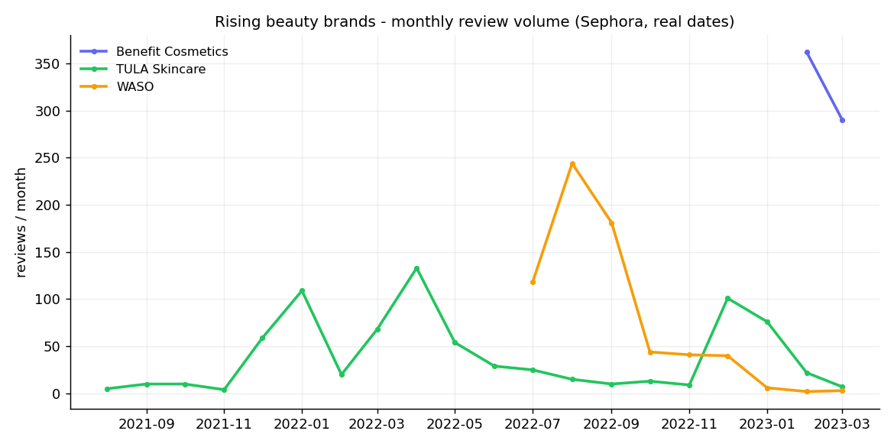

# #08 — Social Trend Analyzer

Detect **rising beauty brands** from real review activity and pair each trend with
customer sentiment, so sellers get **restock guidance**. The whole trend layer runs on
**real, timestamped data — no synthetic timelines, no fabricated numbers**.



- **Sentiment (trained):** XLM-RoBERTa fine-tuned on multilingual tweet sentiment
  (macro-F1 **0.69**), with a TF-IDF + LogReg baseline as offline fallback.
  Exposed as `predict_sentiment(text)`. This engine also lets the system extend to
  **unlabeled sources** (TikTok/Shopee comments) later.
- **Trend:** monthly review volume per brand from real `submission_time` →
  **Prophet** 3-month forecast + a bounded **momentum score [-100, +100]** →
  flags brands genuinely rising.
- **Alert:** rule over trend × sentiment → `RESTOCK` / `MONITOR` / `REDUCE`.
- **Dashboard:** Streamlit (brand trend + product drill-down + live sentiment check).

## Data
- `dataset/by_idea/idea_08_social_trend/sephora_reviews_dated_clean.parquet` —
  79,999 cosmetics reviews with **real dates (2021-01 → 2023-03)**, sentiment labels,
  139 brands, 2,073 products.
- Sentiment model trained on `tweet_sentiment_clean.parquet` (multilingual).

> Per repo policy, **raw data and the 1.1 GB model are gitignored / not committed**.
> `outputs/demo_data.json` bundles the computed results so the dashboard runs standalone.

## Run
```bash
# Dashboard — runs from the bundled results, no raw data or model needed
cd social_trend && streamlit run src/dashboard.py

# Full pipeline (needs the Sephora parquet in dataset/by_idea/idea_08_social_trend/)
python social_trend/src/01_aggregate_brands.py   # reviews -> brand/product x month
python social_trend/src/02_trend_prophet.py      # Prophet + momentum -> rising brands
python social_trend/src/03_alert.py              # RESTOCK / MONITOR / REDUCE
python social_trend/src/04_prepare_demo.py       # bundle -> outputs/demo_data.json
```

## Results
| metric | value |
|---|---|
| Reviews analyzed | 79,999 |
| Brands tracked | 139 (2,073 products) |
| Rising brands (momentum > 20) | 11 |
| Sentiment macro-F1 (XLM-R) | 0.69 |

Sample alerts (all traceable to real reviews):
- 🟢 **Benefit Cosmetics** — strongly rising, ~109 reviews/mo, 94% positive → *restock*
- 🟡 **TULA Skincare** — rising but 78% positive → *monitor quality*
- 🔴 **JLo Beauty** — falling, 50% positive → *reduce stock*

## Serve
`sentiment.predict_sentiment(text) -> {'label', 'score', 'engine'}`

## Demo fallback
The dashboard reads `outputs/demo_data.json` first (chip **Demo · JSON**) → runs even
without the parquet files, the 1.1 GB model, or a network connection. The sentiment box
uses the live model when present, otherwise cached predictions from the bundle.
